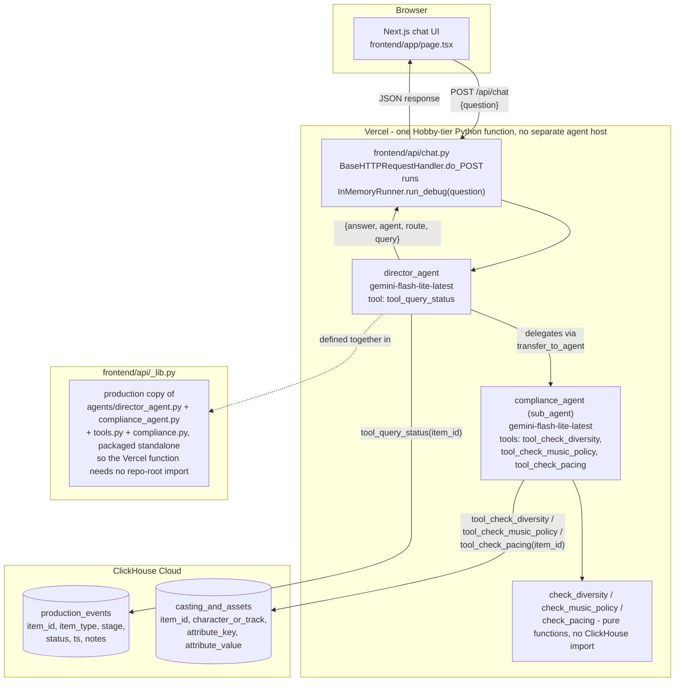
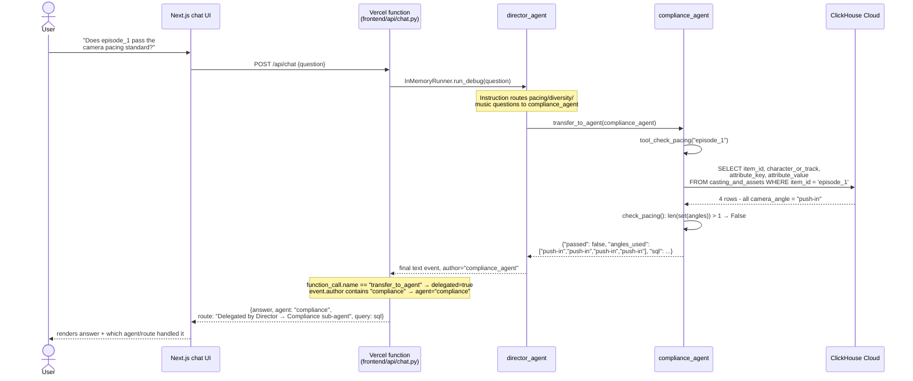

<div align="center">

# BrightKin Studio Director

### Production intelligence, compliance, and release decisions—grounded in one auditable production log.

**Studio Director answers status questions, checks production standards, and now coordinates Greenlight and Release decisions through BrightKin's Studio Mesh layer. Every answer exposes its ClickHouse grounding path.**

<p>
  <a href="https://brightkin-studio-director.vercel.app"></a>
  <a href="https://github.com/jayblast-spec/brightkin-studio-director"></a>
  <a href="https://agentic-cinema.devpost.com"></a>
</p>

<p>
  
  
  
  
  
  
  
  
  
</p>

<p>
  
</p>

</div>

---

## What It Does

Studio Director lets anyone ask plain-language questions about an examiner-safe fictional animated-series pipeline and receive an answer grounded in a freshly queried ClickHouse snapshot. The bundled rows are synthetic demo data, verified as a fixture set on **2026-08-01 UTC**; they are not BrightKin operational evidence.

Four agents built on Google's Agent Development Kit (ADK) divide responsibility without fragmenting the experience:

- **Director agent** (`agents/director_agent.py`) handles direct status lookups itself, via a single tool (`tool_query_status`) that queries the `production_events` table.
- **Compliance agent** (`agents/compliance_agent.py`) is a true ADK sub-agent the Director delegates to for anything touching BrightKin's three documented production standards - cast diversity, original-music-only policy, and camera-pacing variety. It runs its own ClickHouse queries and reports the exact pass/fail result and the specific gap, never a paraphrase.
- **Greenlight agent** (`agents/greenlight_agent.py`) converts the latest append-only production state into an explicit `GO`, `HOLD`, or `NO_DATA` recommendation and identifies the blocking evidence.
- **Release agent** (`agents/release_agent.py`) combines production state with the standards relevant to the item type and returns `READY` or `HOLD`, including every failed evidence gate.

### New BrightKin product layer: Studio Mesh

Studio Mesh is an expansion of Studio Director, not a replacement for it. Studio Director remains the user-facing production-intelligence product: live status, standards checks, tenant-scoped “Bring Your Own Show,” an operational dashboard, and visible query evidence. Studio Mesh is the orchestration layer underneath it that lets the Director call the right specialist at the right decision boundary.

This creates an interwoven workflow instead of four chatbots standing side by side:

1. **Director** identifies the intent and owns the final response.
2. **Compliance** evaluates the documented creative and policy rules.
3. **Greenlight** decides whether work can advance based on the latest event state.
4. **Release** retrieves evidence through the official ClickHouse MCP server, combines applicable gates, and decides whether the item can ship.

All specialists share the same tenant-scoped, append-only ClickHouse memory. Their handoff and the SQL evidence are returned to the interface, so a judge can see both the decision and how the network reached it.

### Official ClickHouse MCP runtime path

The Release specialist actively calls the official `ClickHouse/mcp-clickhouse` server through a FastMCP client (`agents/mcp_evidence.py` → `run_query`). The server runs through FastMCP's in-memory MCP transport, which preserves the actual MCP tool boundary while remaining suitable for a serverless Python function. The existing `clickhouse-connect` layer remains for deterministic parameterized writes, rate limiting, and the lower-level status/compliance helpers; it is no longer the only runtime integration.

Answers are grounded through tool calls against that synthetic snapshot. Agent-generated wording can still be imperfect, so the UI exposes routing and query evidence for inspection. If ClickHouse is unreachable, the API returns an availability error instead of inventing database rows.

## Bring Your Own Show

A judge or tester isn't limited to asking about BrightKin's real data. The **"Try your own show"** toggle in the chat panel (`components/bk/DemoChat.tsx`) switches to a mode scoped to a private id your browser generates once and keeps in `localStorage` (`lib/tenant-client.ts`) - never a cookie, never anything tied to your identity.

**What it actually does:**

- The first time you switch to that mode with no data yet, an intake form (`components/bk/TenantIntakeForm.tsx`) asks for 1–2 track titles + distribution status, and one episode's script status, voice-casting status, a camera-pacing checkbox/note, and a cast-diversity checkbox/note.
- Submitting it does a real `INSERT` into the same `production_events`/`casting_and_assets` ClickHouse tables the real Director/Compliance agents read from (`POST /api/tenant-intake` → `agents/tools.insert_production_event` / `insert_casting_attribute`) - scoped to your browser's tenant id.
- Every question you then ask goes through the exact same Director → Compliance → ClickHouse path described in the architecture section below, just filtered to your rows instead of BrightKin's.

**What it does not do:**

- It does not generate a scene, a script, or any creative content - it only stores the handful of structured facts the form collects, and answers questions strictly from those facts.
- It does not give you a full production-events history the way BrightKin's real (seeded + logged) data has - you get exactly the rows your one intake submission wrote.
- It is not private in a security sense beyond obscurity: the tenant id is a client-generated UUID, not an authenticated identity. Anyone who has your id (e.g. by reading it out of your browser's localStorage) could query the same tenant. There is no login, and this is a public, no-auth demo - treat it accordingly.

**How tenant data stays isolated:** every row in both ClickHouse tables carries a `tenant_id` column (see `scripts/schema.sql`). The bundled synthetic snapshot uses the reserved sentinel `brightkin-canonical` (`agents/tenant.py`). Every read the tool layer (`agents/tools.py`) issues is filtered by `tenant_id` as a bound ClickHouse parameter, and `POST /api/tenant-intake` refuses to write to that sentinel. Isolation and query-construction regressions are covered by the tenant and SQL-safety test suites.

## Architecture

Everything below is drawn directly from the code in this repo - no invented boxes, no generic "AI agent" diagram filler.



**Why these choices, not generic ones:**

- **One Vercel Python function, not a separate agent host.** `frontend/api/chat.py` imports the same `director_agent` object used everywhere else and runs it in-process via ADK's `InMemoryRunner`, inside the Vercel Hobby (free) tier alongside the Next.js frontend. See [Engineering Narrative](#engineering-narrative-the-pivots-that-actually-happened) below for why this replaced the originally-planned Vertex AI Agent Engine deployment.
- **ClickHouse as live agent memory, not a static export.** `agents/tools.py` issues parameterized `SELECT` queries against ClickHouse Cloud on every call - there is no cached/precomputed answer set. The exact SQL run for a given question is even returned to the client (`sql` field in `frontend/api/chat.py`) so the routing is auditable, not a black box.
- **Compliance logic is pure functions, tool wrappers are the only ClickHouse-aware layer.** `agents/compliance.py`'s `check_diversity`, `check_music_policy`, and `check_pacing` take already-fetched rows and return `{"passed": bool, ...}` - they know nothing about ClickHouse. `agents/tools.py` and the tool wrappers in `frontend/api/_lib.py`/`agents/tool_wrappers.py` are the only code that touches the database. This is what let the compliance rules be unit-tested against fixtures before any live database existed.

### Sequence: one real question, end to end

The exact path for "Does episode_1 pass the camera pacing standard?" - a question that requires delegation, based on the actual event/part inspection logic in `frontend/api/chat.py`:



This matches `frontend/api/chat.py`'s actual event-inspection loop: it walks every ADK event, flags `delegated = True` the moment it sees a `transfer_to_agent` function call, pulls the `sql` key out of any function response, and reports whichever agent produced the final text part - so the "which agent answered, and via what query" metadata in the UI is derived from the real event stream, not asserted.

<details>
<summary><strong>Compliance rules as implemented (click to expand)</strong> - the exact logic in <code>agents/compliance.py</code></summary>

| Standard | Rule (as coded) | Fails when (real seeded state) |
|---|---|---|
| Cast diversity | `friend_char_white`, `friend_char_latino`, `friend_char_asian` must each have an `attribute_key="status"` row with `attribute_value="designed"` | Episode 1: all three are seeded `not_designed` - the studio's diversity-cast expansion (confirmed direction 2026-08-03) hasn't been designed yet |
| Music originality | The track's `attribute_key="provenance"` row must equal `"original"` | Evaluated against synthetic provenance rows in the dated demo snapshot |
| Camera-pacing variety | `len(set(camera_angle values)) > 1` across a scene sequence | Episode 1's four cold-open scenes (Lumi, Kairo, Valley, Nova) were all shot as `push-in` - flagged as too uniform |

```python
# agents/compliance.py - unmodified, this is the real file
REQUIRED_DIVERSITY_CHARACTERS = {"friend_char_white", "friend_char_latino", "friend_char_asian"}

def check_diversity(attributes: list[dict]) -> dict:
    designed = {
        a["character_or_track"] for a in attributes
        if a["character_or_track"] in REQUIRED_DIVERSITY_CHARACTERS
        and a["attribute_key"] == "status" and a["attribute_value"] == "designed"
    }
    missing = sorted(REQUIRED_DIVERSITY_CHARACTERS - designed)
    return {"passed": not missing, "missing": missing}

def check_music_policy(attributes: list[dict]) -> dict:
    provenance = next((a["attribute_value"] for a in attributes if a["attribute_key"] == "provenance"), None)
    return {"passed": provenance == "original", "provenance": provenance}

def check_pacing(attributes: list[dict]) -> dict:
    angles = [a["attribute_value"] for a in attributes if a["attribute_key"] == "camera_angle"]
    return {"passed": len(set(angles)) > 1, "angles_used": angles}
```

</details>

<details>
<summary><strong>ClickHouse schema (click to expand)</strong> - <code>scripts/schema.sql</code>, both tables actually queried above</summary>

```sql
-- tenant_id (added for 'bring your own show', see above) scopes every row to
-- one show. DEFAULT keeps existing callers that don't pass it unaffected.
CREATE TABLE IF NOT EXISTS production_events (
    item_id String,
    item_type String,
    stage String,
    status String,
    ts DateTime,
    notes String,
    tenant_id String DEFAULT 'brightkin-canonical'
) ENGINE = MergeTree()
ORDER BY (item_id, ts);

CREATE TABLE IF NOT EXISTS casting_and_assets (
    item_id String,
    character_or_track String,
    attribute_key String,
    attribute_value String,
    tenant_id String DEFAULT 'brightkin-canonical'
) ENGINE = MergeTree()
ORDER BY (item_id, character_or_track, attribute_key);
```

`agents/tools.py` issues parameterized queries against these two tables, both filtered by `tenant_id` as a bound parameter alongside `item_id`:

```sql
SELECT item_id, item_type, stage, status, ts, notes FROM production_events
WHERE item_id = {item_id:String} AND tenant_id = {tenant_id:String} ORDER BY ts;

SELECT item_id, character_or_track, attribute_key, attribute_value FROM casting_and_assets
WHERE item_id = {item_id:String} AND tenant_id = {tenant_id:String};
```

`scripts/migrate_add_tenant_id.py` is the one-time, idempotent `ALTER TABLE ... ADD COLUMN IF NOT EXISTS` migration that added `tenant_id` to the live tables non-destructively (metadata-only change, no rows rewritten) - already run against the live instance this app uses.

</details>

## Engineering Narrative: the pivots that actually happened

This section documents real decisions and dead ends from this build, not a cleaned-up retelling - pulled from `docs/superpowers/specs/2026-08-24-brightkin-studio-director-design.md` and the actual commit history.

**1. Vertex AI Agent Engine → in-process ADK on a Vercel Python function.**
The original design deployed the Director/Compliance agents to Vertex AI Agent Engine, called from a TypeScript API route via a service-account REST call. That requires a GCP project with an active billing account - a card on file, even to spend free trial credit. To avoid that entirely, the agents run **in-process** instead: `frontend/api/chat.py` imports `director_agent` directly and drives it with ADK's `InMemoryRunner.run_debug(...)` inside a single Vercel Hobby-tier Python serverless function, colocated with the Next.js frontend in one deployment. This removed an entire deployment target and its REST-call plumbing, at the cost of not using Vertex AI Agent Engine / Google Cloud Agent Builder specifically - a known tradeoff against one line of the hackathon's stated tooling list, accepted in favor of shipping on a zero-card stack.

**2. Gemini Developer API, not Vertex AI's Gemini.** `frontend/api/_lib.py` sets `GOOGLE_GENAI_USE_VERTEXAI=False` so ADK talks to the free `aistudio.google.com`-issued API key instead of a Vertex-billed endpoint - consistent with the no-billing-account constraint above.

**3. The model name pivoted twice, verified against the live API each time, not documentation.** The original plan used `gemini-2.0-flash`. That model was no longer served to new API keys by the time this was built - confirmed by the live API's own error response, not by reading changelog docs. The fix moved to `gemini-3.6-flash`, confirmed working. That model then hit its **free-tier cap of 20 requests/day** during testing - so both agents (`agents/director_agent.py`, `agents/compliance_agent.py`) were switched again to `gemini-flash-lite-latest`, which the live API accepts. Every switch was validated by an actual call succeeding, not by assuming a docs page was current.

**4. ClickHouse over a static JSON export.** The brief's ClickHouse track requires a live runtime integration, not a build-time snapshot - every one of the four tool functions (`tool_query_status`, `tool_check_diversity`, `tool_check_music_policy`, `tool_check_pacing`) issues a fresh parameterized `SELECT` against ClickHouse Cloud per question, and the exact SQL text is threaded back through the response (`_events_sql`/`_attributes_sql` in `frontend/api/_lib.py`) so a judge can see the real query behind a given answer.

**5. A local-machine DNS gotcha, isolated behind a flag instead of silently patched everywhere.** During development, this machine's default DNS resolver didn't have the freshly-provisioned ClickHouse Cloud service's record yet, even though public resolvers (8.8.8.8) did. Rather than hard-coding a workaround into production, `frontend/api/_lib.py` gates a `socket.getaddrinfo` monkey-patch behind `CLICKHOUSE_FORCE_PUBLIC_DNS=1` - opt-in, and left at `0` in the Vercel production environment, since Vercel's own resolver never hit the issue.

**6. Compliance logic was written and unit-tested before any live database existed.** `agents/compliance.py`'s three check functions take already-shaped `list[dict]` rows and are pure - no ClickHouse import, no network call. That let `tests/test_compliance.py` cover pass/fail fixtures for all three standards independently of ClickHouse Cloud provisioning, and it's why the ClickHouse-aware code (`agents/tools.py`, the tool wrappers) is a thin, separately-testable layer on top.

## Try It Live

### Protecting canonical writes

Public reads, chat, and the tenant-scoped "Try your own show" flow remain available without an admin credential. Writing through `POST /api/events` targets BrightKin's canonical production log and is therefore fail-closed: configure a strong, server-side `EVENTS_ADMIN_KEY`, then enter that value in the dashboard when performing an administrative write. The browser sends it only with that write request; it is not stored in local storage. If the variable is absent, canonical writes return `503`; an invalid key returns `401`.

All JSON API handlers reject bodies larger than `MAX_JSON_BODY_BYTES` (32 KiB by default) before reading them. The Next.js app also emits baseline CSP, framing, MIME-sniffing, referrer, and browser-permission headers.

**[brightkin-studio-director.vercel.app](https://brightkin-studio-director.vercel.app)**

Paste this into the chat - it exercises the full delegation path (Director → Compliance → ClickHouse) shown in the sequence diagram above, against Episode 1's real, currently-failing camera-pacing state:

```
Does episode_1 pass the camera pacing standard?
```

Or ask a direct status question the Director answers itself, no delegation:

```
What stage is track_we_are_the_future at?
```

## Tech Stack

| Layer | Technology |
|---|---|
| Agent orchestration | Google Agent Development Kit (`google-adk`), `InMemoryRunner` |
| Model | Gemini (`gemini-flash-lite-latest`, Gemini Developer API - not Vertex AI) |
| Data / agent memory | ClickHouse Cloud (`production_events`, `casting_and_assets`) |
| Backend | Python (Vercel serverless function, `frontend/api/chat.py`) |
| Frontend | Next.js (App Router), React, TypeScript |
| Hosting | Vercel (single Hobby-tier deployment, frontend + backend colocated) |

<details>
<summary><strong>Run it locally (click to expand)</strong></summary>

```bash
# Python side (agents + tests)
pip install -r requirements.txt
cp .env.example .env   # fill in CLICKHOUSE_HOST / USER / PASSWORD and a Gemini API key
python -c "from agents.clickhouse_client import get_client; get_client().command(open('scripts/schema.sql').read())"
python scripts/seed_clickhouse.py
pytest tests/ -v

# Frontend (Next.js + the colocated Python API function)
cd frontend
npm install
npm run dev   # http://localhost:3000
```

</details>

## 🧠 The Agent Pattern — Extend This

Everything this demo does reduces to one mechanism: a routing agent (`director_agent`) answers directly from a tool call, or delegates to a specialist sub-agent (`compliance_agent`), and both are grounded in parameterized ClickHouse queries whose exact SQL is returned alongside the answer (`agents/tools.py`, `frontend/api/chat.py`). Nothing about that loop is animation-specific. Three ways to point it at something else:

- **Swap the schema, keep the loop.** `production_events` (`item_id, item_type, stage, status, ts, notes`) and `casting_and_assets` (`item_id, character_or_track, attribute_key, attribute_value`) are generic stage/status + structured-attribute tables. Repoint them at render-farm jobs, vendor deliverables, or rights-clearance records and `tool_query_status` / `get_attributes` need zero changes.
- **Swap the compliance functions, keep the agent split.** `agents/compliance.py`'s `check_diversity`, `check_music_policy`, and `check_pacing` are pure functions over already-fetched rows — no ClickHouse import. Write a new pure function against the same `list[dict]` shape (e.g. `check_delivery_spec(attributes)`) and wire it into `compliance_agent`'s tool list; the Director → Compliance delegation and the SQL-grounding response format carry over untouched.
- **Swap single-item lookups for a slate-wide sweep.** `list_latest_items` already does a `GROUP BY item_id` / `argMax(x, ts)` pass across every row for the dashboard — extend that pattern into the compliance path so a question like "which shots fail pacing" runs one aggregate query instead of one lookup per item.

Example prompts to hand Claude or Cursor, once you've swapped in your own schema:

```
Using agents/tools.py as the template, add a tool_query_render_status(item_id) function that
reads from a `render_jobs` table (job_id, shot_id, frame_range, status, ts) instead of
production_events - keep the same parameterized {name:Type} binding, the same @with_retry
decorator, and the same tenant_id filtering pattern.
```

```
Following the shape of agents/compliance.py's check_pacing, write a pure function
check_delivery_spec(attributes: list[dict]) -> dict that fails when any row with
attribute_key="frame_rate" doesn't equal the studio's required value - no ClickHouse import,
same {"passed": bool, ...} return shape, and add a pytest fixture-based test like
tests/test_compliance.py.
```

```
Extend agents/tools.list_latest_items's GROUP BY / argMax(x, ts) pattern into a new
list_failing_compliance(tenant_id) function that runs check_diversity/check_music_policy/
check_pacing across every item_id in one pass instead of one tool_check_* call per item,
and returns just the failing ones with their specific gap.
```

<div align="center">


</div>
